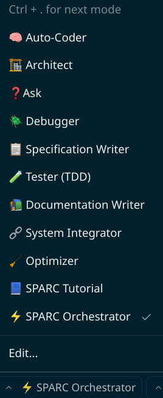

# Roo-Code Agents & MCP Setup

Roo Code is an autonomous open-source AI agent designed to code, debug, and evolve software systems with minimal human input. Its like cursor, but unleashed. It is extremely customizable and here we are going to get it [OVER 9000!](https://www.youtube.com/watch?v=QsDDXSmGJZA).

The following setup is to have [roocode](https://roocode.com/), ([github](https://github.com/RooVetGit/Roo-Code)) better agentic capabilities even for complex projects and augment it with MCP to provide domain specific context.

## Prerequisites

1. Install roo-code if you don't have it yet, following [official documentation](https://docs.roocode.com/getting-started/installing) or if you have VSCode, download from Extensions.

2. Clone this repo.

3. Clone the `mcp-code` [repo](https://github.com/pablof7z/mcp-code) anywhere you want and follow its instructions to build it. This is our MCP server built for [Nostr](https://nostr.org/).

4. Install `cursor-tools` from their [github]((https://github.com/eastlondoner/cursor-tools)) (not strictly necessary). This is for the feedback loop using gemini for the code generated for evaluation.

4. Get an API key from any of your LLM providers, OpenRouter, PPQ.ai(accepts lightning) are good ones that allow you to use many of the latest LLMs

## Info on files

- `.roomodes`: Has all the info on all the different modes(agents) we have configured in SPARC.
- `.cursorrules`: Has the rules for `cursor-tools`

## Steps

1. Create a test project directory & copy all the files (incl dotfiles) from the settings directory in to your test project directory.

2. Start VSCode with roocode installed.

3. Go in to Settings & setup your API keys & endpoints.

3. Once you get out of roocode settings and look under the chat section, you should see the SPARC Agents:



5. Connect to your `mcp-code` MCP server by clicking the MCP server icon and `Edit Project MCP` and adding the following:

```json
{
  "mcpServers": {
    "mcp-code": {
      "command": "<FULL/PATH/TO/mcp-code>",
      "args": [
        "mcp"
      ],
      "alwaysAllow": [
        "find_snippets",
        "find_user",
        "list_usernames",
        "fetch_snippet_by_id",
        "publish-new-code-snippet",
        "wallet_balance",
        "deposit",
        "zap",
        "create_pubkey"
      ],
      "disabled": false
    }
  }
}
```

## Usage

We are fully setup to test our setup. We will do a comparative test.

Open another instance of VSCode with roocode in a `vanilla-test-roo` project directory that doesn't have these config files and no MCP server setup. 

Now, enter the same prompt for simple app idea in both the projects and see if you have any difference. Choose an app idea for Nostr since we have set this setup for nostr domain expertise.

**Example prompt:** `make a cli app to post GM fiatjaf`

**LICENSE:** `GPL-2.0`
